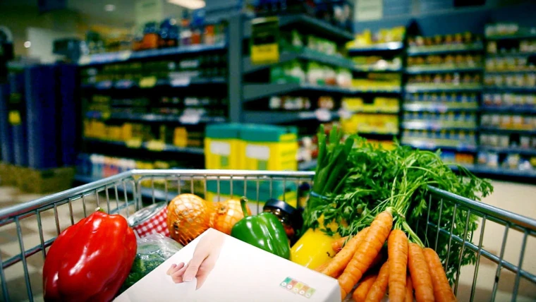

<h1 align = "center">  InstaCart Marketbasket Analysis </h1>
<h2 align = "center"> By: Thomas Cornett </h2>

<!-- TABLE OF CONTENTS -->
<details open="open">
  <summary><h2 style="display: inline-block">Table of Contents</h2></summary>
  <ol>
    <li>
      <a href="#about-the-project">About The Project</a>
      <ul>
        <li><a href = "#business-problem"> Business Problem</a></li>
        <li><a href="#built-with">Built With</a></li>
      </ul>
    </li>
    <li>
      <a href="#getting-started">Getting Started</a>
      <ul>
        <li><a href="#prerequisites">Prerequisites</a></li>
        <li><a href="#installation">Installation</a></li>
      </ul>
    </li>
    <li>
      <a href="#method">Method</a>
      <ul>
        <li><a href="#obtain">Obtain</a></li>
        <li><a href="#scrub">Scrub</a></li>
        <li><a href="#obtain">Explore</a></li>
        <li><a href="#model">Model</a></li>
      </ul>
      <li><a href="#application">Application</a></li>
    <li><a href="#conclusion">Conclusion</a></li>
    <li><a href = "#future-works">Future Works</a></li>
      <li><a href="#contact">Contact</a></li>
    </li>
  </ol>
</details>

## About The Project
This project was given to me by <b> Market Intervals Investigation </b> to help them figure out how they can maximize their profits by finding trends in the products that people put in their baskets. To gain insight of this type of information I used the data from the Kaggle Competition on the Instacart Market Basket Analysis Located at https://www.kaggle.com/c/instacart-market-basket-analysis/data. With the Instacart data I was thrown into working with over 3 million orders and purchase information from different anonymized users and what they have purchased over the course of 2017. I used machine learning in this project to interpret some idea in what the customer would like based on 5 to 10 different recommendations and with those ratings my program would recommend 10 different products based on popularity.
## Business Problem
With everything going digital and the rising climb of Data Analytics, every business wants to understand their customers and what they like. What products are the best to keep extras of, what can I get less of to maximize the stores profits, what is an everyday staple that no household can go without, what aisles/departments were the most shopped as well as what was the "prime" time that users needed those products. These are the type of questions I was asking myself when I was tasked with this project. After answering these questions I felt building a recommendation system to try to target some of the not so popular or unknown items to customers to help maximize some of the sales of other items.


## Built With
* Python
* Kivy /KivyMD
* Jupyter Lab

## Getting Started
To get a local copy of the application up and running follow these steps

## Prerequisites
* Install Kivy & KivyMD
* Pycharm or another IDE installed
* pandas, surprise, requests, json preinstalled

## Installation
1. Clone the repo
```sh 
git clone https://github.com/Corneth/Capstone.git
```
2. Install Kivy packages in the interpreter
```sh !pip install Kivy```
```sh !pip install KivyMD```
3. Download files from Kaggle and put in the folders labeled Data. (Link below)
## Method
The method I used with this project was the OSEMN process.

## Obtain
As stated above I used the data from the Kaggle competition from 2017 Marketbasket Data Analysis as the base information which gave me over 3 million orders from 200,000 users in a range of 4 -100 orders from each user. I felt that was enough raw information from the users for analysis but lacked in products so I went to the FDC database on food. the FDC database is used to search for certain foods that the kaggle data have and allow us to pull that information and input it into a seperate file to use for analysis later as potential products to bring into by the company.
* <a href="https://www.kaggle.com/c/instacart-market-basket-analysis/data">Kaggle Dataset</a>
* <a href="https://fdc.nal.usda.gov/"> Information on FDC Database</a>

## Scrub
The data was pretty clean when it came to errors in the data,which is nice, not really that many missing values or wrong types of values so I did not mess too much with that, but there was a lot of departments and aisle items that were considered "Missing" and had a whole plethora of different types of aisles and departments that should have been categorized so I dropped them.

## Explore
I noticed that in the data there was some interesting statistics.The days since prior order column shows that a lot of people would order the most in the first week of the month or the last day of the month or the very end of the month. There was also a trend in the time of day that the shoppers would go and order their products which surprisingly shows that users ordered during working hours, between 9am and 5pm. That is surprising to me considering that most people would be in work during those times, but it quickly declines in orders before and after that timeframe. Another trend was the day of the week that users tended to buy things, this wasn't really surprising considering that most people would want to shop at the beginning of the week. After that I took a look into clustering the data based on the volume of the aisles and the departments and used that to figure out the percentages each area did in sales.


## Model
I built a simple python recommendation system based off of the times a user purchased the product. Initially when ran the accuracy of the program was a 4.75 and after some exploration I found that the reason behind that was the purchases were skewed with the bulk buys. To counter that I decided that anything above a 5 meant they really liked the product so I lowered anything above a 5 to being just that, a 5. After doing that the accuracy went down to a 1.5 error which in my eyes is a lot better. After taking out the missing category I merged everything together into one "Master" dataframe and quickly learned that with my computers hardware that it was very taxing on my system. After realizing that I took a sample of 150,000 points. 


## Application
After a satisfactory model was built I began to develop an App that a store can use as a simple list maker and recommendation system. With the resources I have available I was only able to use 50,000 points from the dataset for the recommendation system built into it or else it takes about 10 minutes to run before you get the recommended products. It is built around the Kivy framework, which is considered a build once deploy everywhere.


## Conclusion
Even though it is difficult to determine what is the best way for market research to find trends I feel that with the data I was given that:
* After lowering the rating scale from 1-100 to 1-5 we get better accuracy across the board.
* Popularity skewed the data a bit but we were able to fix it by rerunning the recommendations after getting more information from users habits and likes
* Clustering the data is a great way for target marketing to users.

## Future Works

* Generate keywords on the items to create and operate a search function by products.
* Create an external database to offload the data from local machine to make the program run faster and operate the application recommend on the full dataset. As stated above computational power for application is very lacking.
* Impliment an efficient-apriori algorithm to find and create associations with certain items like bread,eggs usually go with bacon
* As always more updated data is needed

## Contact
For additional information, contact me at: thmscrntt33@gmail.com
